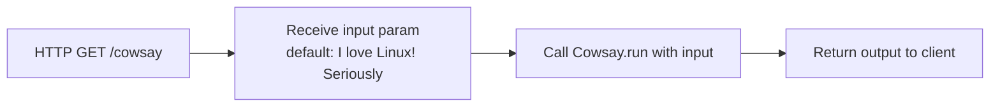
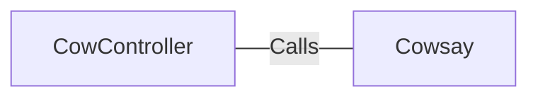

# CowController.java: REST Controller for Cowsay Command Execution

## Overview
A Spring Boot REST controller that exposes an HTTP endpoint to execute the `Cowsay` utility, accepting a user-supplied input string and returning the command output.

## Process Flow



## Insights
- The controller uses `@EnableAutoConfiguration` directly on the controller class, which is unconventional — this annotation is typically placed on the main application entry point class.
- The default value for the `input` parameter is `"I love Linux! Seriously"`, meaning the endpoint is functional even without query parameters.
- No input validation, sanitization, or length restriction is applied to the `input` parameter before it is passed to `Cowsay.run()`.
- No authentication or authorization mechanism is present on the endpoint.

## Dependencies



- `Cowsay` : Receives the raw user-supplied `input` string via `Cowsay.run(input)` and executes the cowsay command, returning its output.

---

## Vulnerabilities

### 1. Command Injection (Critical)
The `input` parameter received from the HTTP request is passed **directly** to `Cowsay.run(input)` without any sanitization or validation. If `Cowsay.run()` internally builds a shell command using this input (e.g., via `Runtime.exec()` with shell interpolation), an attacker can inject arbitrary OS commands.

**Example attack vector:**
```
GET /cowsay?input=hello;cat+/etc/passwd
```

### 2. Missing Input Validation
No constraints (length, character whitelist, format) are enforced on the `input` request parameter, enabling abuse through oversized payloads or special characters.

### 3. No Authentication or Authorization
The `/cowsay` endpoint is publicly accessible with no security controls, exposing the command execution capability to any unauthenticated user.

### 4. `@EnableAutoConfiguration` Misuse
Placing `@EnableAutoConfiguration` on the controller instead of the main application class can lead to unintended auto-configuration behavior, potentially loading unnecessary or insecure components into the application context.
