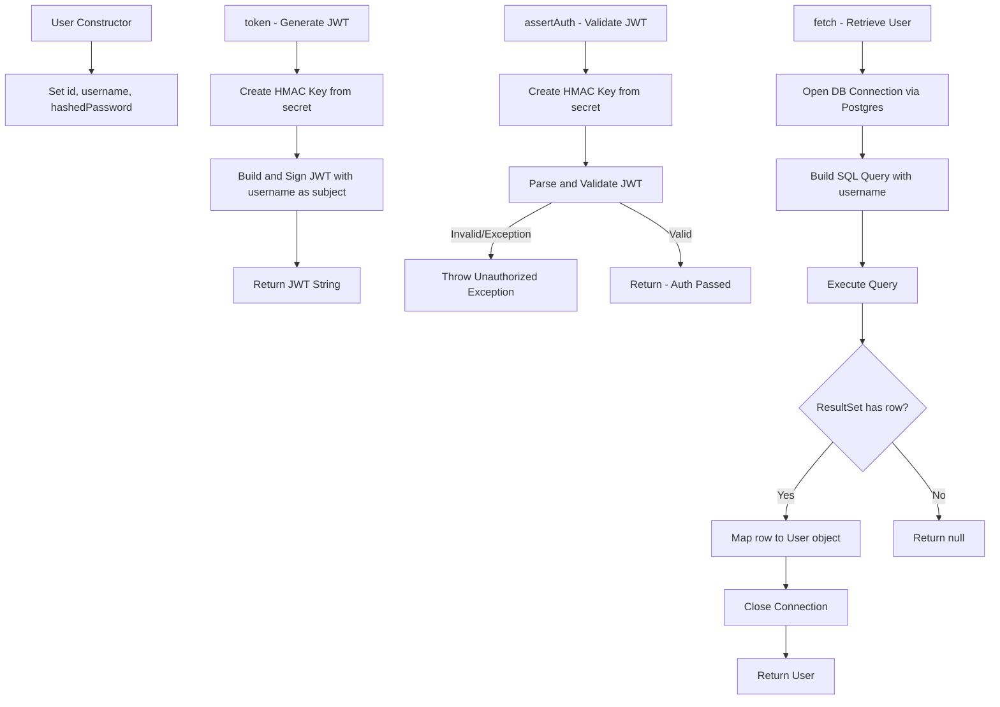
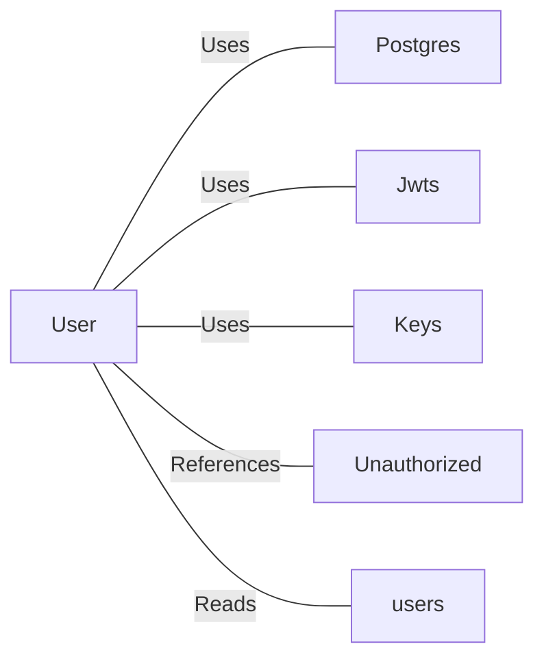

# User.java: User Authentication and Management

## Overview

This class represents a `User` entity within the `com.scalesec.vulnado` package, responsible for user data encapsulation, JWT token generation and validation, and user retrieval from a PostgreSQL database.

---

## Process Flow



---

## Insights

- **JWT signing** uses `Keys.hmacShaKeyFor(secret.getBytes())`, meaning the security of the token is entirely dependent on the strength and secrecy of the `secret` parameter passed at runtime.
- The `assertAuth` method only validates the JWT signature and claims; no expiration or custom claim checks are performed.
- The `fetch` method always returns `null` on any exception (including DB failures) due to the `finally` block returning `user` regardless of outcome — this can silently swallow errors.
- The class mixes data structure concerns (field declarations) with business logic (JWT, DB access), violating the Single Responsibility Principle.
- `hashedPassword` is stored as a plain field on the object and potentially exposed through general object access.

---

## Dependencies



| Dependency | Description |
|---|---|
| `Postgres` | Called via `Postgres.connection()` to retrieve a live JDBC `Connection` to the database |
| `Jwts` | Used to build (`Jwts.builder`) and parse (`Jwts.parser`) JSON Web Tokens |
| `Keys` | Used to derive an HMAC `SecretKey` from a raw byte array for JWT signing/verification |
| `Unauthorized` | Custom exception thrown when JWT validation fails in `assertAuth` |
| `users` | PostgreSQL table queried by the `fetch` method to retrieve user credentials by username |

---

## Data Manipulation (SQL)

| Attribute | Type | Notes |
|---|---|---|
| `userid` | `String` | Mapped from `rs.getString("userid")` |
| `username` | `String` | Mapped from `rs.getString("username")` |
| `password` | `String` | Mapped from `rs.getString("password")` — treated as hashed password |

- `users`: **SELECT** — Retrieves a single user record matching the provided username (`WHERE username = '<un>' LIMIT 1`).

---

## Vulnerabilities

- **SQL Injection (Critical)**
  The `fetch` method constructs the SQL query via direct string concatenation:
  ```
  "select * from users where username = '" + un + "' limit 1"
  ```
  No parameterized queries or prepared statements are used, making this fully exploitable. Additionally, the literal string `DELETE` appears appended in the query, suggesting intentional or accidental malicious data manipulation.

- **Hardcoded / Weak Secret Risk (High)**
  The `secret` used for JWT signing is passed as a plain `String`. If a short or predictable value is used, the HMAC key can be brute-forced, allowing token forgery.

- **Silent Exception Suppression (Medium)**
  The `fetch` method's `finally` block returns `user` unconditionally, meaning exceptions are only printed to stderr and never propagated. This can cause the caller to silently receive `null` without any indication of failure type.

- **Information Disclosure via Stack Trace (Low)**
  Both `fetch` and `assertAuth` call `e.printStackTrace()`, which may expose internal class/package structure and stack trace details to logs or potentially to end users depending on the logging configuration.

- **Missing JWT Expiration Validation (Medium)**
  Tokens generated by `token()` carry no expiration (`setExpiration` is never called), meaning issued tokens are valid indefinitely until the signing secret is rotated.
